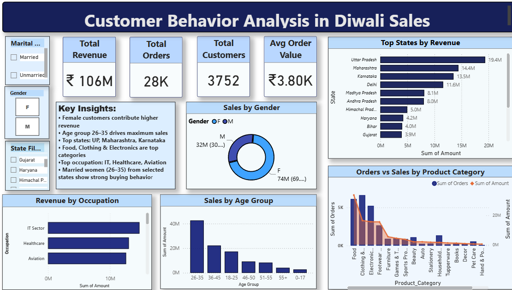

# 📊 Customer Behavior Analysis in Diwali Sales

An interactive Business Intelligence dashboard developed using **Power BI** and **Python** to analyze customer purchasing behavior during the Diwali festive season. The project uncovers customer demographics, sales trends, and product performance to support business decision-making through data-driven insights.

---

# 🎯 Business Problem

Festive seasons generate a significant portion of annual retail revenue. Businesses need to understand:

- Who are their most valuable customers?
- Which states generate the highest revenue?
- Which products drive maximum sales?
- Which customer segments contribute the most revenue?

This dashboard answers these business questions through interactive visualizations and KPI reporting.

---

# 🛠️ Tools & Technologies

- 📊 Power BI
- 🐍 Python
- 🐼 Pandas
- 📈 Matplotlib
- 🌊 Seaborn
- 📄 Jupyter Notebook

---

# 📁 Dataset

The dataset contains customer transactions from Diwali sales, including:

- Customer Demographics
- Gender
- Age Group
- State
- Occupation
- Product Category
- Orders
- Revenue

---

# 📸 Dashboard Preview
<p align="center">
  
</p>

---

# 📈 Key Performance Indicators (KPIs)

| KPI | Value |
|------|------:|
| Total Revenue | ₹106M |
| Total Orders | 28K |
| Total Customers | 3,752 |
| Average Order Value | ₹3.80K |

---

# 📊 Dashboard Features

✔ Interactive KPI Cards

✔ Dynamic Filters (Gender, Marital Status, State)

✔ Revenue by State Analysis

✔ Revenue by Occupation

✔ Sales by Gender

✔ Sales by Age Group

✔ Orders vs Revenue by Product Category

✔ Executive Business Insights Panel

---

# 💡 Business Insights

- Female customers contribute the highest overall revenue.
- Customers aged **26–35 years** generate the maximum sales.
- Uttar Pradesh, Maharashtra, and Karnataka are the top-performing states.
- Food, Clothing, and Electronics are the highest-selling product categories.
- Married women aged 26–35 from selected states demonstrate strong purchasing behavior.
- IT, Healthcare, and Aviation professionals contribute significantly to overall revenue.

---

# 📂 Repository Structure

```
Customer-Behavior-Analysis-Diwali-Sales
│
├── README.md
├── diwali_sales_dashboard.pbix
├── diwali_sales_dashboard.png
├── DiwaliSales_Analysis.ipynb
└── Diwali_Sales.csv
```

---

# 🚀 Skills Demonstrated

- Data Cleaning
- Exploratory Data Analysis (EDA)
- Business Intelligence Reporting
- Dashboard Design
- Data Visualization
- Interactive Dashboard Development
- Storytelling with Data
- Business Insights Generation

---

# 📚 Project Workflow

1. Data Collection
2. Data Cleaning using Python
3. Exploratory Data Analysis
4. Business Insight Extraction
5. Data Modeling in Power BI
6. Dashboard Design
7. KPI Development
8. Interactive Reporting

---

# 📌 Future Improvements

- Drill-through Reports
- Time-Series Sales Analysis
- Customer Segmentation using RFM Analysis
- Predictive Sales Forecasting
- Mobile-Optimized Dashboard

---

# 👩‍💻 About Me

**Garima Singh**

MBA (Data Analytics & Visualization)

Aspiring Data Analyst | Power BI Developer | MIS Reporting

🔗 **LinkedIn:** https://www.linkedin.com/in/garima-singh-565649374/

💻 **GitHub:** https://github.com/gariimasiingh

---

## ⭐ If you found this project helpful, consider giving it a Star! 


 
